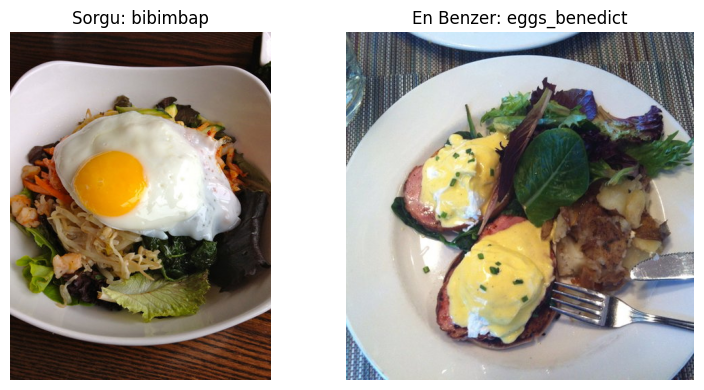
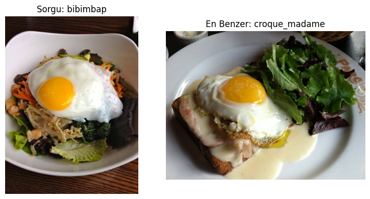
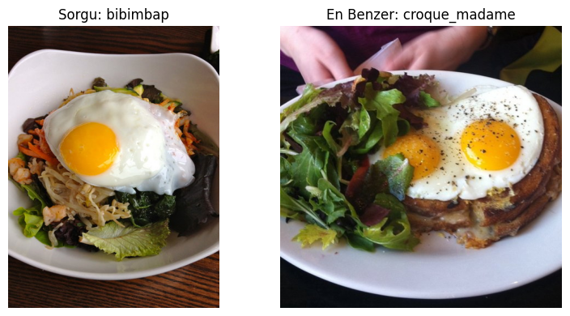

# 🧠 Görsel Yiyecek Benzerliği Analizi
**CNN Tabanlı Öznitelik Çıkarımı ve Sıralama Metrikleri ile Food-101 Üzerinde Karşılaştırmalı Çalışma**  
*(nisa_durak_baharDonemOdevi)*

## Mobilnet

## resnet50

## densenet

## vgg

---

## 📌 Proje Özeti
Bu proje, Food-101 veri setindeki yiyecek görselleri üzerinde **görsel benzerlik tespiti** gerçekleştirmek için dört farklı CNN mimarisi kullanır:

- ResNet50  
- DenseNet121  
- MobileNetV3-Large  
- VGG16  

### Yiyecek görseli en benzer başka kategorideki yiyecekle eşleştirilir

Her modelin sınıflandırıcı katmanı çıkarılarak görüntüler embedding vektörlerine dönüştürülür. Görseller arası benzerlik **cosine similarity** ile ölçülür; ardından modeller **Top-1**, **Top-5**, **Precision@5**, **MAP@5** ve **NDCG@5** gibi sıralama odaklı metriklerle değerlendirilir.

---

## 📂 Veri Seti: Food-101
- **101 sınıf**, her sınıf için 1000 görüntü  
- **Toplam 101.000 görüntü**  
- Gerçek kullanıcı fotoğraflarından oluşan, gürültülü ve yüksek çeşitlilik sunan bir veri kümesi  
- Tüm görseller modele girdi olarak verilmeden önce 224×224 boyutuna ölçeklendirildi ve ImageNet ortalama/std değerleri ile normalize edildi.

---

## 🧠 Kullanılan CNN Modelleri

| Model | Embedding Boyutu | Özellik |
|-------|------------------|---------|
| **ResNet50** | 2048 | Residual bloklarla güçlü soyutlama |
| **DenseNet121** | 1024 | Katmanlar arası yoğun bağlantı |
| **MobileNetV3-Large** | 1280 | Hafif, hızlı, modern mobil mimari |
| **VGG16** | 4096 | Klasik bir model, yüzeysel özellik çıkarımı |

---

## 🔍 Benzerlik Hesaplama
Benzerlik ölçümünde **cosine similarity** kullanılmıştır:

\[
\text{cosine\_sim}(A,B) = \frac{A \cdot B}{\|A\|\|B\|}
\]

Bu yöntem, vektör büyüklüğünden bağımsız olarak yalnızca **yönsel benzerliğe** odaklandığı için embedding karşılaştırmalarında idealdir.

---

## 📊 Kullanılan Değerlendirme Metrikleri
Aşağıdaki metrikler sıralama kalitesini ölçmek için kullanılmıştır:

- **Top-1 Accuracy**
- **Top-5 Accuracy**
- **Precision@5**
- **Recall@5**
- **MAP@5**
- **NDCG@5**

Bu metrikler, bir modelin doğru örneği bulmak kadar **onu üst sıralara yerleştirme başarısını** da değerlendirir.

---

## 🏆 Sonuçların Özeti

### 📈 Genel Metrik Karşılaştırmaları
**MobileNetV3-Large tüm metriklerde en yüksek performansı sergilemiştir.**

| Model | Top-1 | Top-5 | Precision@5 | MAP@5 | NDCG@5 |
|-------|-------|--------|--------------|--------|---------|
| **MobileNetV3-Large** | **0.5644** | **0.7426** | **0.4564** | **0.5982** | **0.6458** |
| DenseNet121 | 0.4703 | 0.7277 | 0.4079 | 0.5402 | 0.5971 |
| ResNet50 | 0.4455 | 0.6881 | 0.3950 | 0.5166 | 0.5690 |
| VGG16 | 0.4109 | 0.6188 | 0.3426 | 0.4644 | 0.5117 |

---

## ⚙️ Model Karmaşıklığı
Model verimliliği ve FLOPs karşılaştırması:

| Model | Parametre (M) | FLOPs (G) |
|--------|---------------|-----------|
| **MobileNetV3-Large** | **5.48** | **0.23** |
| DenseNet121 | 7.98 | 2.90 |
| ResNet50 | 25.56 | 4.13 |
| VGG16 | 138.36 | 15.47 |

**MobileNet**, hem en hafif mimari hem de en yüksek doğruluğu sağlayan modeldir.

---

## 🔬 Sınıf Zorluk Analizi

| Model | Basit Sınıf Başarımı | Karmaşık Sınıf Başarımı |
|--------|------------------------|---------------------------|
| **MobileNetV3-Large** | **0.70** | **0.60** |
| DenseNet121 | 0.60 | 0.30 |
| ResNet50 | 0.60 | 0.35 |
| VGG16 | 0.65 | 0.10 |

Basit sınıflarda tüm modeller orta-üst seviyede performans gösterirken, karmaşık yapılı yiyeceklerde yalnızca MobileNet yüksek başarıyı sürdürebilmiştir.

---

## 🚀 Gelecek Çalışmalar
Geliştirme için önerilebilecek yöntemler:

- Modellerin Food-101 üzerinde **fine-tuning** yapılması  
- Contrastive learning / triplet loss ile **benzerlik temelli embedding öğrenimi**  
- Görsellere ek olarak tarif/metin verisinin eklenmesiyle **multimodal sistem** tasarımı  
- Büyük ölçekli retrieval için FAISS / PQ gibi **hızlandırma teknikleri**

